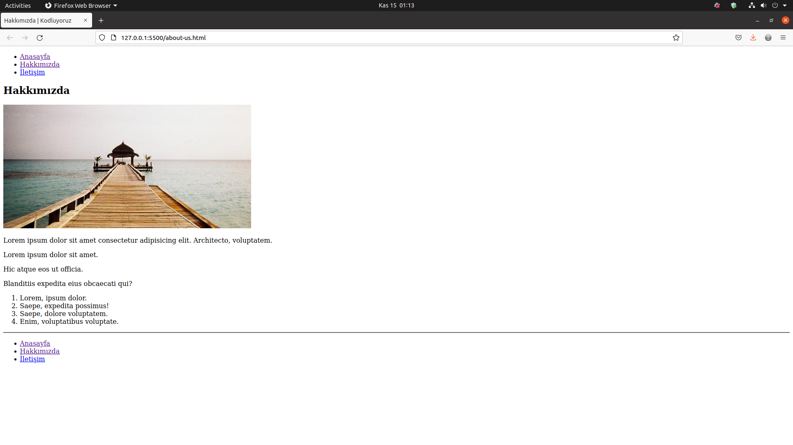

# Creating First Web Page
This repo built for the [Kodluyoruz](https://www.kodluyoruz.org/) Front-End HTML education.



## Installation

First clone the project

```
git clone https://github.com/luftedar/patika-html-chapter-work.git
```

## Usage

After cloning the project cd into the file and open it with your text editor.

```linux
cd html-homework-1
code .
```

## Authors

👤 **Orçun Uğur**

- GitHub: [Luftedar](https://github.com/luftedar)
- Twitter: [OrcunUgur2](https://twitter.com/OrcunUgur2)
- LinkedIn: [LinkedIn](https://www.linkedin.com/in/orcunugur)

## 🤝 Contributing

Contributions, issues, and feature requests are welcome!

Feel free to check the [issues page](../../issues/).

## Show your support

Give a ⭐️ if you like this project!

## 📝 License

This project is [MIT](./MIT.md) licensed.
